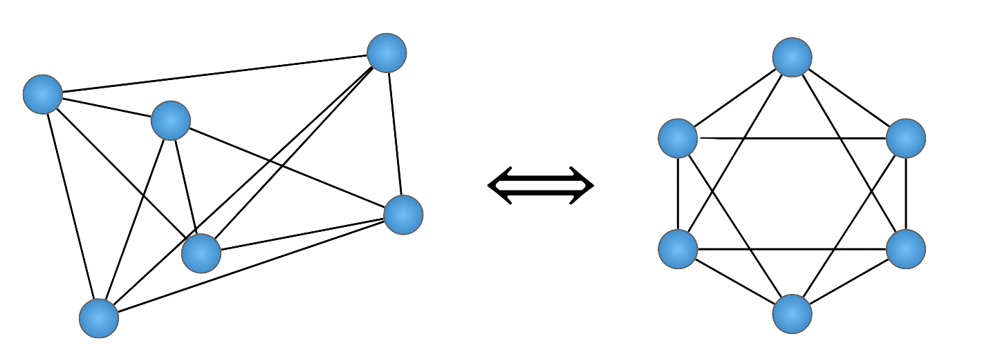
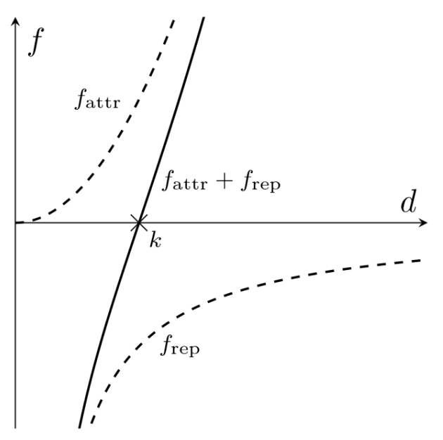
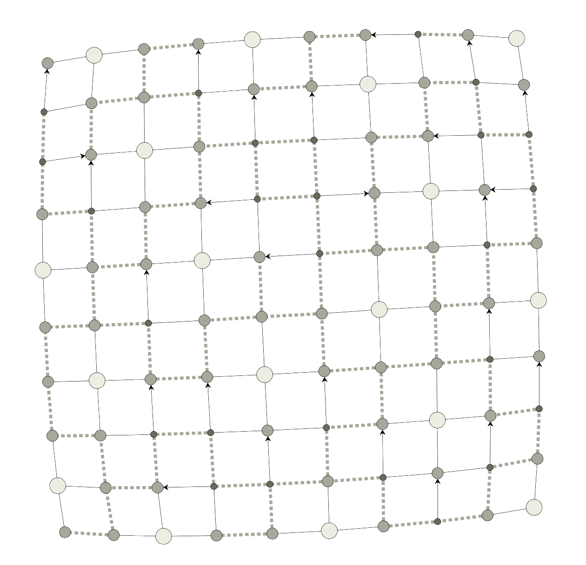
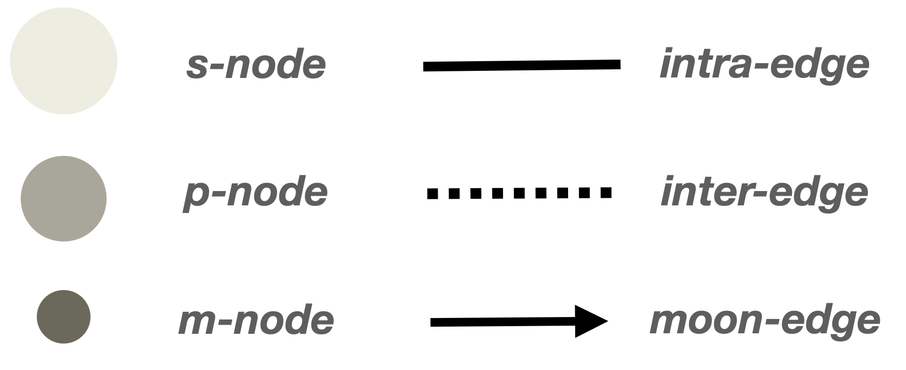
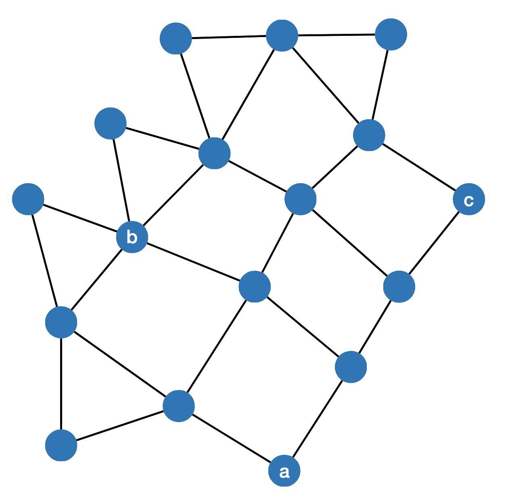
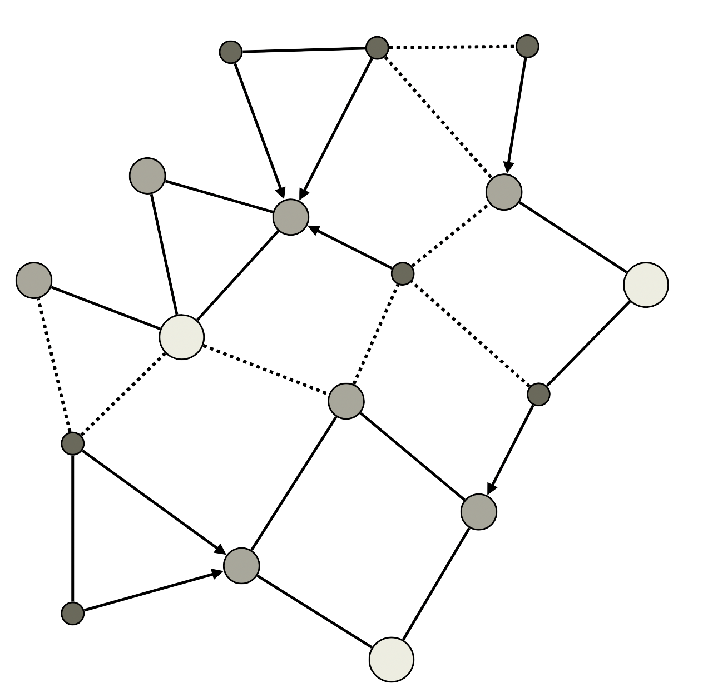
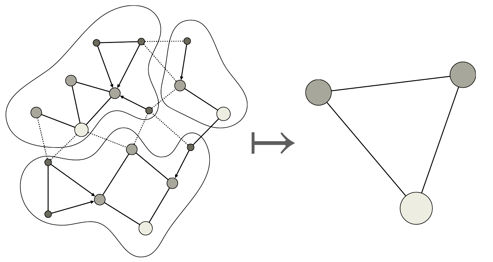
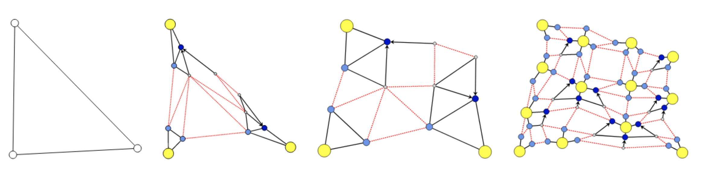
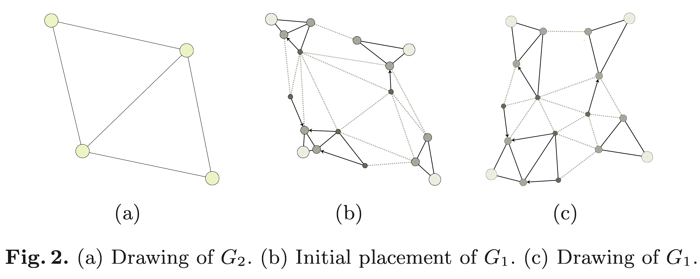

<!-- Global style -->
<style>
h1 {
  color: orange;
	text-align: center;
	position: absolute;
	font-size: 1.2em;
  left: 80px;
  top: 40px;
  right: 80px;
  height: 70px;
  line-height: 20px;
}
code{
	tab-size: 2;
}
section{
	font-size: 2.15em
}
section img {
	text-align: center !important;
}
img[alt~="center"] {
  display: block;
  margin: 0 auto;
}
footer {
	text-align: center;
}
</style>

<!-- paginate: true -->
<div style="text-align: left; font-size: 1.5em; color: orange; ">

Force-directed layouts

</div>

<div style="text-align: left; font-size: 0.8em; color: gray; ">
Drawing Large Graphs with a Potential-Field-Based Multilevel Algorithm
</div>

<br> 
<br>

<div style="text-align: left; font-size: 0.8em; color: gray; ">
Matt Piekenbrock
</div>

---
# Force-directed layout

*Force* directed (FD) layouts are motivated by the need for:
<!-- <div data-marpit-fragment> -->

1. Even spacing between nodes 
2. Minimal number of edge crossings 
3. Uniform placement of nodes around the screen
4. Revealing symmetry in tangled graphs

The *force directed philosophy*:
* Use simple forces to implicitly handle issues (1-4)
* Empirical performance >> Analytical tractability

<!-- </div> -->


In terms of bounds, guarantees, etc. FD offers no advantages. 

That said, in practice, the heuristic work quite well! 

---

# Spring Embedders

<style>
blockquote { font-size: 0.75em; }
section{ text-align: left; }
img{ text-align: center; float: center; margin-left: auto; justify-content: center; }
</style>

The first attempt at force-directed layout was the through the use of *spring embedders* 
> The basic idea is as follows. To embed [lay out] a graph we replace the	vertices by steel rings and replace each edge with a spring to form a mechanical system... The vertices are placed in some initial layout and let go so that the spring forces on the rings move the system to a minimal energy state.

Foundational thought: to layout a graph $G = (V, E)$, treat is as a *physical system*, i.e. subject it to certain forces and let it reach a "steady state"
<!-- _footer: Eades, Peter. "A heuristic for graph drawing." Congressus numerantium 42 (1984): 149-160. -->
---

# Force-directed layout
 <iframe width="100%" height="100%" frameborder="0"
  src="https://observablehq.com/embed/@d3/force-directed-graph?cells=chart"></iframe>
<!-- _footer: From: https://observablehq.com/embed/@d3/force-directed-graph  -->

---

<!-- _blockquote { font-size: 0.55em; } -->
# Fruchterman Reingold: Insight 
(1) *Connected* vertices should be close 
(2) ... but no vertices should be *too* close 

> At a distance of about 1 fm [femto-meter] the strong nuclear force is attractive and about 10 times the electric force between two protons. The force decreases rapidly with increasing distance... when two nucleons are within about 0-4 fm of each other, the strong nuclear forces become repulsive. 


<!-- _footer: Fruchterman, Thomas MJ, and Edward M. Reingold. "Graph drawing by force‐directed placement." Software: Practice and experience 21.11 (1991): 1129-1164. -->

---

# Fruchterman Reingold: Insight 
What are we trying to achieve? Let $n = \lvert V\rvert$ and $d_{ij} = \lVert v_i - v_j \rVert$. Want an optimal layout $P^\ast$ satisfying:  

$$\argmin_{P \subset \mathbb{R}^{n \times 2}} \sum\limits_{i < j}c_{ij}(d_{ij} - k_{ij})^2$$

where $k_{ij}$ is the "ideal distance" between $v_i$ and $v_j$ and $c_{ij}$ is a scaling constant 
- Note: This is actually solved by Multi-dimensional Scaling (MDS) if $k_{ij}$ is known!
--- 

# Fruchterman Reingold: Insight 
Optimal distance between vertices ought to be: 
$$k = C \sqrt{A / \lvert V \rvert }$$
where: 
	$\quad k \approx$ radius of empty area around a vertex 
  $\quad A$ = area of screen 
  $\quad C$ = constant scaling factor 

How can we optimize the layout such that every vertex is at distance $k$ from each other? 
<!-- _footer: Fruchterman, Thomas MJ, and Edward M. Reingold. "Graph drawing by force‐directed placement." Software: Practice and experience 21.11 (1991): 1129-1164. -->
---

# Fruchterman Reingold: Insight 

$$\text{Objective: }\quad \argmin_{P \subset \mathbb{R}^{n \times 2}} \sum\limits_{i < j} c_{ij}(d_{ij} - k_{ij})^2$$

Fruchterman's idea: 
(1) Connected vertices should be close (*attraction*)
(2) ... but no vertices should be *too* close (*repulsion*)
 
We can encapsulate these heuristics as functions:
$$ f_a(d) = d^2 / k $$
$$ f_r(d) = - k^2 / d $$
<!-- _footer: Fruchterman, Thomas MJ, and Edward M. Reingold. "Graph drawing by force‐directed placement." Software: Practice and experience 21.11 (1991): 1129-1164. -->

---
$$ \text{Objective} \approx \sum\limits_{i < j} f_a(d_{ij}) + f_r(d_{ij})$$



<!-- _footer: From https://schneide.blog/tag/fruchterman-reingold/ -->
---

# Force directed issues

- Problem: If $G$ is complex (or large), the objective $\hat{f}$ may yield *many* local minima
- Solution: Throw computation at it!
  - Idea => iteratively adjust positions over time 
(example)
---

```python
procedure Layout(G = (V, E))
	for i = 1 to n do
		for each v in V do
			disp(v) = 0
			for each u in V do
				if u ≠ v then
					Δ = pos(v) - pos(u)
					disp(v) = disp(v) + Δ/|Δ| · f_rep(u, v)
		for each (u, v) in E do
			Δ = pos(v) - pos(u)
			disp(v) = disp(v) - Δ/|Δ| · f_attr(u, v)
			disp(u) = disp(u) + Δ/|Δ| · f_attr(u, v)
		for each v in V do
			pos(v) = pos(v) + disp(v)/|disp(v)| · |disp(v)|
```
Does anyone see anything wrong with this?
<!-- _footer: From https://schneide.blog/tag/fruchterman-reingold/ -->
---

# Force directed issues

- Problem \#1: If $G$ is complex (or large), the objective $\hat{f}$ may yield *many* local minima 
- Solution \#1: Throw computation at it!
  - Idea => iteratively adjust positions *over time*
  - Problem \#2: minima may never actually be reached!
- Solution \#2: Add *temperature* and *cooling* to the system (treat it as as physical system!)

---

# Simulated Annealing 


<!-- _footer: From https://en.wikipedia.org/wiki/Simulated_annealing/ -->

---
```python
procedure Layout(G = (V, E))
	initialize temperature t
	for i = 1 to n do
		for each v in V do
			disp(v) = 0
			for each u in V do
				if u ≠ v then
					Δ = pos(v) - pos(u)
					disp(v) = disp(v) + Δ/|Δ| · f_rep(u, v)
		for each (u, v) in E do
			Δ = pos(v) - pos(u)
			disp(v) = disp(v) - Δ/|Δ| · f_attr(u, v)
			disp(u) = disp(u) + Δ/|Δ| · f_attr(u, v)
		for each v in V do
			pos(v) = pos(v) + disp(v)/|disp(v)| · min(|disp(v)|, t)
		t = cool(t)
```
<!-- _footer: From https://schneide.blog/tag/fruchterman-reingold/ -->

---

<div style="text-align: center; font-size: 1.5em; color: orange; ">

Reminder to stop and show iterations of FR

</div>

---

# Force directed issues

- Problem \#1: If $G$ is complex (or large), the objective $\hat{f}$ may yield *many* local minima 
- Solution \#1: Throw computation at it!
  - Idea => iteratively adjust positions *over time*
  - Problem \#2: minima may never actually be reached!
- Solution \#2: Add *temperature* to the system
  - Treat it as as physical system!
  - Problem \#3: This is **slow!** ($O(\lvert V\rvert^2$) *per iteration*)

Opinion: It's not immediately clear how to fix Problem \#3  

---
# Detour: Solar Systems
<div style="margin-top: 50px;">

Suppose we interpret $G$ as a _galaxy_ (set of *solar systems*)

Recall: a *partition* of a set $\mathcal{X}$ is a set of non-empty subsets $\{X_1, \dots, X_k\}$ such that: 
$$ \mathcal{X} = \bigcup_{i = 1}^k X_k, \quad X_i \neq X_j \implies X_i \cap X_j = \emptyset $$

Partition $V$ such that each $v \in V$ is a *sun*, a *planet*, or a *moon*
- Every planet node is the neighbor of some sun node
- Every moon node is the neighbor of some planet node
- Every sun node is part of a *solar system*

Let's make this a bit more exact... 
</div>

--- 

# Detour: Solar Systems

Partition $G = (V, E)$ into solar systems $\mathcal{S}$: 
$$\mathcal{S} = \{S^{0}, S^{1}, \dots, S^{k}\}$$
such that: 
- Each $v \in V$ is a $(s,p,m)$-node (sun, planet, moon)
- Each $e \in E$ is a $(\phi, \psi, \rightarrow)$-edge (intra, inter, directed)
- $S^i \cap S^j = \emptyset \quad \forall i,j \in [n]$ (partition)
- $S^i := G[U]$ is an induced subgraph of $s_i$ where each $u \in U \subseteq V$ satisfies $d_G(s_i, u) \leq 2$ (solar system)

---

<div class="grid grid-cols-2 gap-2">
<div>



</div>

<div style="vertical-align: center; display: grid; align-self: center;">



</div>
</div>

--- 

# Observations

If $G = (V, E)$ is partitioned by $\mathcal{S}$ with $\lvert \mathcal{S}\rvert = k$, then: 
- Each $s$-node is in exactly one solar system 
- Each $m$-node has exactly one $p$-node as a neighbor
- A partitioning $\mathcal{S}$ can be obtained in $O(\lvert V\rvert + \lvert E \rvert)$ time 

Greedy algorithm:
1. Set $V' = V$ 
2. Choose a $s$-node $s_i \in V'$ arbitrarily 
3. $V' = V' \setminus S^i$ ($S^i$ induced by $s_i$)
4. Repeat 2-3 until $V' = \emptyset$

---

# Activity

<div class="grid grid-cols-2 gap-4" style="margin-top: 60px;">
<div>




</div>

<div>

Greedy algorithm:
1. Set $V' = V$ 
2. Choose $s_i \in V'$ arbitrarily 
3. $V' = V' \setminus S^i$
4. Repeat 2-3 until $V' = \emptyset$
  
<br>


Optional: Choose sun nodes in order $a, b, c$
</div>

</div>

---

<div class="grid grid-cols-2 gap-4" style="margin-top: 60px;">
<div>


</div>

<div>



</div>

---

# Coarsening 

<div style="padding-top: 60px;">

- Suppose each solar system $S^i$ is *collapsed* to a vertex positioned its corresponding barycenter

- Similarly: collapse inter-system edges weighted with some heuristic (e.g. average edge weights)

- Observe this takes $O(\lvert V\rvert + \lvert E \rvert)$ time

Inductively: Let $G = G_0$, $G_i =$ *coarsened* graph of $G_{i-1}$, such that we have a *multilevel representation* of $G$:

$$ G_0 \hookleftarrow G_{1} \hookleftarrow \dots \hookleftarrow G_k $$

such that $X \hookleftarrow Y$ indicates that $Y$ is a coarsening of $X$ 

</div>

---



---

# Analysis Part \#1

- Every node $v_i$ belongs to exactly one solar system
- Every solar system contains at least $2$ nodes
  $\implies$ $G_{i+1}$ contains *at most* $\frac{1}{2} \rvert V_i \rvert$ nodes 
  $\implies$ there are *at most* $k \leq \log(\lvert V \rvert)$ collapsed graphs


	
	Picture from (1) showing 3 coarsenings

<!-- _footer: 1. Hachul, Stefan, and Michael Jünger. "Large-graph layout with the fast multipole multilevel method." Spring, V (December) (2005) -->

---

# a Multi-level Layout Algorithm

<div style="margin-top: 40px;">

**End Detour:** *Why did we just do all of that?*

Recall we want to accelerate: 
$$\sum\limits_{i < j} f_a(d_{ij}) + f_r(d_{ij})$$

The multi-layer representation motivates the following:
1. Create $G_0 \hookleftarrow G_{1} \hookleftarrow \dots \hookleftarrow G_k$ 
2. Apply forces to $G_k$ 
3. Propagate information from (2) to $G_{k-1}$
4. Repeat steps 2-3 until reaching the original $G_0$

</div>

---



<!-- _footer: 1. Hachul, Stefan, and Michael Jünger. "Large-graph layout with the fast multipole multilevel method." Spring, V (December) (2005) -->

---

# Analysis Part \#2

Complexity of multi-layer layout: 
$$ T_{\text{multi}} = \sum\limits_{i=0}^k \left(  T_{\text{partition}}(G_i) + T_{\text{coarsen}}(G_i) + T_{\text{force}}(G_i) \right)$$

Note we've shown: 
	1. $\sum\limits_{i=0}^k  T_{\text{partition}}(G_i) \sim O(\lvert V \rvert + \lvert E \rvert)$
	2. $\sum\limits_{i=0}^k  T_{\text{coarsening}}(G_i) \sim O(\lvert V \rvert + \lvert E \rvert)$
  
$$ \implies T_{\text{multi}} \cong T_{\text{force}}$$ 

---

# Analysis Part \#2: continued

Assume $\lvert  E_{i+1} \rvert \leq \frac{1}{2} \lvert E_{i} \rvert$ for all $i \in \{0, 1, \dots, k\}$. Then: 

$\quad \sum\limits_{i=0}^k T_{\text{force}}(G_i) = \sum\limits_{i=0}^k T(\lvert V_{i} \rvert, \lvert E_{i} \rvert)$
	
$\quad \leq \sum\limits_{i=0}^k T_{\text{force}}(\frac{\lvert V \rvert}{2^i}, \frac{\lvert E \rvert}{2^i}) \quad$ (because $\frac{1}{2} \rvert V_i \rvert \leq \lvert V_{i-1} \rvert$)

$\quad \leq T_{\text{force}}(\lvert V \rvert, \lvert E \rvert) \sum\limits_{i=0}^k \frac{1}{2^i} \quad$ (for large $\lvert V \rvert$ and $\lvert E \rvert$)

$\quad \leq 2 \, T_{\text{force}}(\lvert V \rvert, \lvert E \rvert) \quad$ (by geometric series)

$\quad \implies T_{\text{multi}} \sim \Omega(\lvert V \rvert + \lvert E \rvert)$

--- 

# Can we do better?

$O(\lvert V \rvert + \lvert E \rvert)$ is much better than $O(\lvert V \rvert^2)$ if $G$ is sparse 

Can be improved to $O(\lvert V \rvert \log \lvert V \rvert)$ (!) if the _fast multipole method_ (FMM) is employed

Listed by SIAM editors in top 10 algorithms of previous century[1]

FMM Perspective: 
	- solar system decomposition is just one type of decomposition
	- there are plenty of others (e.g. quadtrees)! 

<!-- _footer: 1. https://archive.siam.org/news/news.php?id=637 -->


--- 

# What are Quad Trees?


Quad tree $\Leftrightarrow$ hierarchical decomposition of points in $\mathbb{R}^2$ where each node has fixed degree 4. 

<!-- _footer: From: https://developer.apple.com/documentation/gameplaykit/gkquadtree -->

---

# What is the Fast Multipole Method?

<iframe
  src="https://andyljones.com/posts/multipole-methods.html"
  style="width:100%; height:80%;"
></iframe>

---

<div style="text-align: center; font-size: 1.5em; color: orange; ">

Reminder to stop and show FMM benchmark

</div>

---

<div style="text-align: center; font-size: 1.5em; color: orange; ">

Thank you

</div>


---


<!-- # How to do in practice? 

<div style="margin-top=60px;">

In practice, one would implement the algorithm using the *Fast Multipole Method* (FMM) with the levels determined by e.g. a *refined quad tree*.

> For space restrictions, we can neither describe every basic component of this algorithm in detail, nor compare our method with the existing ones in a satisfactory way... We have developed a new O(N log N ) method that is omitted here for brevity, since it quite technical. 

Programming can be kind of hard... 

...be nice to open source developers! 

Authors give implementation in full version of paper[1].

-->

